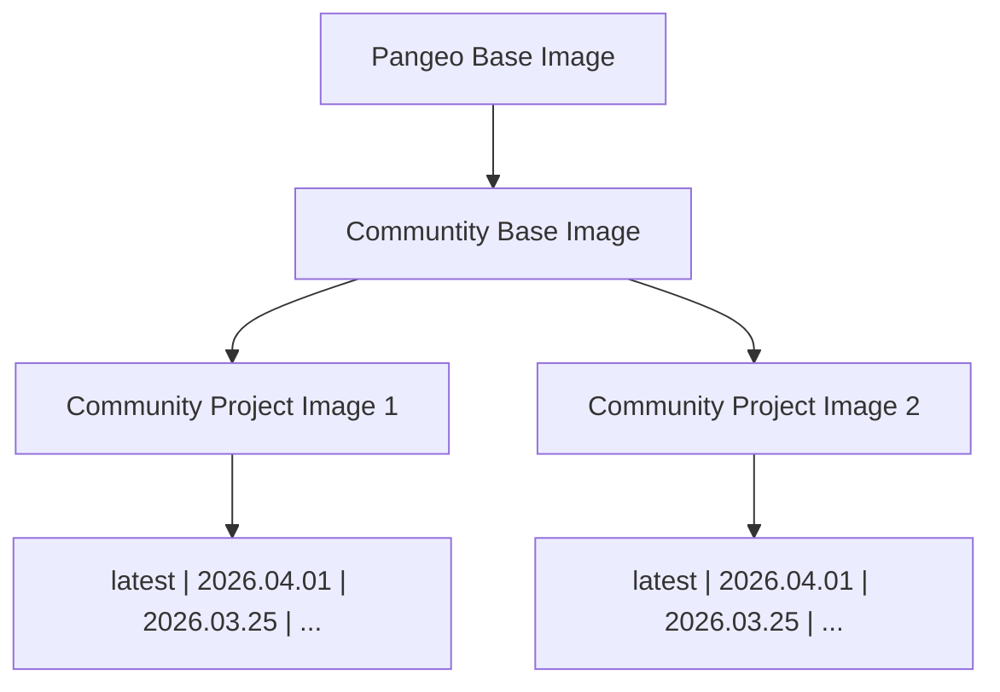

# Example "Stack" of Docker Images

Communities want to provide their users with slightly customized versions of popular upstream
images (like [pangeo](https://hub.docker.com/u/pangeo) or [jupyter/docker-stacks](https://github.com/jupyter/docker-stacks)).
They want to:

1. Have a 'base' image for their own community, adding packages & customizations
   used by their entire community
2. Have individual images that are specific to particular projects or subcommunities,
   that inherit from the base community image and make further customizations.
3. Provide tagged and dated releases of these images automatically, so users can
   easily switch to newer versions of images or continue using existing images
   as needed.

This repository provides infrastructure for doing so, in an automated and easy way!

## What is here?

This repository contains 3 images:

1. A ["Base" image](https://quay.io/repository/2i2c/example-image-stack-base?tab=tags) (under [`base/`](base/)), which inherits from the popular `pangeo/pangeo-notebook`
   image. Additional packages are added via [`base/environment.yml`](base/environment.yml) - in our case, we add:
   - `astropy`
   - The ability to run VSCode in the browser (via [code-server](https://github.com/coder/code-server))
   - The ability to connect *to* the hub via ssh, both from the terminal and from tools like local desktop VSCode (via [jupyter-sshd-proxy](https://github.com/yuvipanda/jupyter-sshd-proxy))
2. An example image for a [`project1`](https://quay.io/repository/2i2c/example-image-stack-project1?tab=tags) (under [`project1`](project1/)), which inherits from the base image
   in this repository. In addition to the packages in base, we install the `ephem` astronomy
   library, via [`project1/environment.yml`](project1/environment.yml) file.
3. An example image for a [`project2`](https://quay.io/repository/2i2c/example-image-stack-project2?tab=tags) (under `project2`), which inherits from the base image
   in this repository. In addition to the packages in base, we install the `pymc` astronomy
   library, via [`project2/environment.yml`](project2/environment.yml) file.

For each image, the following sets of tags are available:

1. A `latest` tag, pointing to the last built image
2. A tag for each day that the image was built (eg. `2026-04-10`, `2026-05-11`, etc)
3. A tag for each git commit hash that was built (eg. `2a3db6e`, etc)

Right now, the images are built each time a PR is merged. In the future, we will
automatically build and tag images once every other week, so users have access to
newer images *if* they would like, and admins can set default images for their
communities as they desire.

## Using older versions of images

You can find the older versions of all these images by looking through the 'tags'
page on quay.io for them:

- [Base Image Tags](https://quay.io/repository/2i2c/example-image-stack-base?tab=tags)
- [Project 1 Image Tags](https://quay.io/repository/2i2c/example-image-stack-project1?tab=tags)
- [Project 2 Image Tags](https://quay.io/repository/2i2c/example-image-stack-project2?tab=tags)

We recommend using tags with a date!