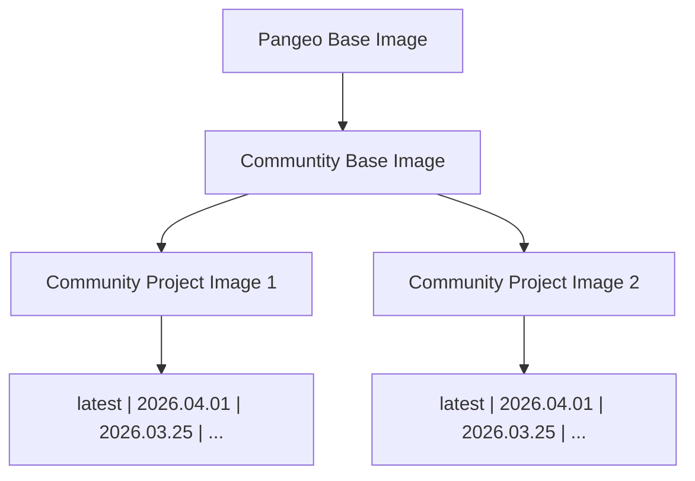

# Example "Stack" of Docker Images

Communities want to provide their users with slightly customized versions of popular upstream
images (like [pangeo](https://hub.docker.com/u/pangeo) or [jupyter/docker-stacks](https://github.com/jupyter/docker-stacks)).
They want to:

1. Have a 'base' image for their own community, adding packages & customizations
   used by their entire community
2. Have individual images that are specific to particular projects or subcommunities,
   that inherit from the base community image and make further customizations.
3. Provide tagged and dated releases of these images automatically, so users can
   easily switch to newer versions of images or continue using existing images
   as needed.

This repository provides infrastructure for doing so, in an automated and easy way!

## How to use this?

This repository contains 3 images:

1. A "Base" image (under `base/`), which inherits from the popular `pangeo/pangeo-notebook`
   image. Additional packages are added via `base/environment.yml` - in our case, we simply
   add a version of `astropy`
2. An example image for a `project1` (under `project1`), which inherits from the base image
   in this repository. In addition to the packages in base, we install the `ephem` astronomy
   library.
3. An example image for a `project2` (under `project2`), which inherits from the base image
   in this repository. In addition to the packages in base, we install the `pymc` astronomy
   library.

## Features

1. Inherits from a specific tagged version of the `jupyter/scipy-notebook`, whole image can be upgraded by changing
   the `FROM` tag in `Dockerfile`
2. All modifications happen in `environment.yml` file, which is not container specific. Regular users can use this too.
3. Users can test out their image **interactively** by making a PR, which will automatically create a comment with a link to
   mybinder.org, which will build the image *exactly* the same way our action does. This allows users to contribute packages
   and changes to this repo without needing docker installed locally. [See example PR](https://github.com/yuvipanda/example-inherit-from-community-image/pull/1)
4. On making PRs, a GitHub action builds the image to make sure it can be built. This catches issues with syntax errors and
   missing versions.
5. Tests inside the `image-tests/` directory are also run on each PR, allowing for more fine-grained tests - either as
   `pytest` tests or as jupyter notebooks that must reproduce exactly. This helps catch issues with version upgrades breaking
   your instructional code. The tests are invoked as part of the [`jupyterhub/repo2docker` action](https://github.com/jupyterhub/repo2docker-action). See [here](https://github.com/jupyterhub/repo2docker-action#testing-the-built-image#testing-the-built-image) for more details.
6. When a PR is merged, the image is built and pushed to [quay.io](https://quay.io/repository/yuvipanda/example-inherit-from-community-image?tab=info)
